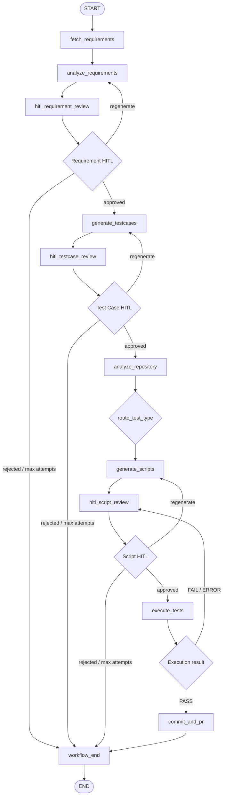

# Parent Workflow

This document describes the parent LangGraph workflow that orchestrates all agent workflows.

## Location

Primary files:

- `graph/workflow.py`
- `graph/nodes.py`
- `graph/edges.py`
- `graph/state.py`

The compiled graph is created by:

```python
build_workflow()
```

The singleton accessor is:

```python
get_workflow()
```

## Design Goals

The parent workflow is responsible for:

- sequencing the STLC stages
- preserving shared workflow state
- enforcing human approval gates
- routing regeneration and rejection paths
- preventing downstream agents from consuming unapproved output
- routing failed execution back to script review
- creating a PR only after validation passes

## State Model

The parent graph passes one shared `AgenticQEState` object through all nodes.

### Source Configuration

```text
source_type
jql_filter
requirement_ids
```

### Requirement Analysis State

```text
raw_requirements
analyzed_requirements
requirement_hitl_status
requirement_feedback
requirement_regeneration_attempts
```

### Test Case State

```text
generated_testcases
testcase_hitl_status
testcase_feedback
testcase_regeneration_attempts
```

### Script Generation State

```text
repo_analysis
web_crawl_data
generated_scripts
script_dependencies
script_setup_commands
script_hitl_status
script_feedback
script_regeneration_attempts
```

### Execution and PR State

```text
execution_results
auto_heal_attempts
pr_url
```

### Control State

```text
current_workflow
error
messages
```

## High-Level Flow



## Node Responsibilities

### `fetch_requirements`

Fetches requirements from Jira.

Behavior:

- If `state.requirement_ids` is set, fetches those specific issues.
- Otherwise uses the configured JQL filter.
- Stores raw serialized requirements in `state.raw_requirements`.
- Moves `current_workflow` to `analyze_requirements`.

Failure behavior:

- sets `state.error`
- appends error details to `state.messages`

### `analyze_requirements`

Runs `RequirementAnalyserAgent` on each raw requirement.

Writes:

- `state.analyzed_requirements`
- `state.requirement_hitl_status = "pending"`
- `state.current_workflow = "hitl_requirement_review"`

### `hitl_requirement_review`

Interrupts execution for human review.

Expected human actions:

- `approved`
- `rejected`
- `regenerate`

Regeneration feedback is stored in:

```text
state.requirement_feedback
```

### `generate_testcases`

Runs `TestCaseGeneratorAgent` using approved requirement analysis.

Writes:

- `state.generated_testcases`
- `state.testcase_hitl_status = "pending"`
- `state.current_workflow = "hitl_testcase_review"`

### `hitl_testcase_review`

Interrupts execution for test-case review.

Feedback is stored in:

```text
state.testcase_feedback
```

### `analyze_repository`

Runs repository ingestion and analysis before script generation.

Current behavior:

- checks only latest `main`
- uses repo SHA cache
- refreshes Chroma and coding-agent repo profile only when `main` changes
- falls back to reference repo if target repo is empty

Writes:

```text
state.repo_analysis
```

### `generate_scripts`

Runs `ScriptGeneratorAgent`.

Inputs:

- approved test cases
- repo analysis
- optional web crawl data
- script regeneration feedback

Writes:

- `state.generated_scripts`
- `state.script_dependencies`
- `state.script_setup_commands`
- `state.script_hitl_status = "pending"`

### `hitl_script_review`

Interrupts execution for script review.

Feedback is stored in:

```text
state.script_feedback
```

### `execute_tests`

Runs `TestExecutorAgent`.

Despite the historical name, this is currently a repository validation gate, not a browser test runner.

It validates:

- latest `main` sync or empty repo path
- dependency declarations
- compile/syntax state

Writes:

- `state.execution_results`
- `state.auto_heal_attempts`
- `state.current_workflow = "check_execution_result"`

### `commit_and_pr`

Creates a GitHub PR if execution validation passed.

Current implementation uses the GitHub REST API helper.

Writes:

- `state.pr_url`
- `state.current_workflow = "done"`

On failure:

- writes `state.error`
- keeps workflow near execution result review
- appends a failure message

### `workflow_end`

Terminal graph node.

Writes:

```text
state.current_workflow = "end"
```

## Routing Rules

Routing lives in `graph/edges.py`.

### Requirement HITL Routing

Function:

```python
route_after_requirement_hitl
```

Rules:

- `approved` -> `generate_testcases`
- `regenerate` -> `analyze_requirements`
- `rejected` -> `workflow_end`
- max regenerations -> `workflow_end`

### Test Case HITL Routing

Function:

```python
route_after_testcase_hitl
```

Rules:

- `approved` -> `analyze_repository`
- `regenerate` -> `generate_testcases`
- `rejected` -> `workflow_end`
- max regenerations -> `workflow_end`

### Test Type Routing

Function:

```python
route_test_type
```

Current behavior:

- detects test types from `state.generated_testcases`
- logs whether UI tests exist
- routes to `generate_scripts` in all cases

This leaves room for future split paths such as web crawl before script generation.

### Script HITL Routing

Function:

```python
route_after_script_hitl
```

Rules:

- `approved` -> `execute_tests`
- `regenerate` -> `generate_scripts`
- `rejected` -> `workflow_end`
- max regenerations -> `workflow_end`

### Execution Result Routing

Function:

```python
route_execution_result
```

Rules:

- latest execution status `PASS` -> `commit_and_pr`
- anything else -> `hitl_script_review`
- missing result -> `workflow_end`

## Human-in-the-Loop Contract

The parent workflow expects each HITL response to include:

```json
{
  "action": "approved|rejected|regenerate",
  "feedback": "optional feedback"
}
```

The graph stores feedback in the matching state field and increments regeneration counters for `regenerate`.

## Regeneration Limits

Each major generation stage allows up to 3 regeneration attempts:

- requirement analysis
- test case generation
- script generation

When the limit is reached, the graph routes to `workflow_end`.

## Parent Workflow Success Criteria

The parent workflow succeeds when:

1. requirements are fetched and analyzed
2. requirement analysis is approved
3. test cases are generated and approved
4. repository profile is loaded or refreshed from `main`
5. scripts are generated and approved
6. executor validation passes
7. GitHub PR is created against `main`

## Failure Modes

### Requirement Fetch or Analysis Failure

Expected behavior:

- record `state.error`
- append message
- do not advance to test-case generation

### Test Case Generation Failure

Expected behavior:

- append error message
- remain available for regeneration or correction

Common causes:

- LLM JSON parse failure
- token/rate limit failure
- missing or ambiguous requirement details

### Repository Ingestion Failure

Expected behavior:

- use fallback repo analysis if possible
- use default Playwright-BDD conventions if both target and reference repos are empty

Common causes:

- repo not found
- branch missing
- GitHub auth failure
- vector store initialization failure

### Script Generation Failure

Expected behavior:

- if LLM returns no parseable files, fallback scripts are generated
- if hard failure occurs, script review/regeneration should be used

Common causes:

- LLM response not valid JSON
- token-per-minute limit
- oversized prompt

Current mitigation:

- compact test-case prompt context
- compact repo profile
- limited vector-search snippets
- output token cap

### Execution Validation Failure

Expected behavior:

- route back to script review
- block PR creation

Common causes:

- missing dependency in `package.json`
- TypeScript compile error
- invalid JSON fixture
- branch conflict or missing `main`

### PR Creation Failure

Expected behavior:

- record error
- do not mark workflow complete

Common causes:

- PAT missing `Contents: read/write`
- PAT missing `Pull requests: read/write`
- existing file update missing SHA
- GitHub API validation error

## UI Relationship

The React/FastAPI UI follows the same logical stages but uses API endpoints instead of LangGraph interrupts.

Important API endpoints:

```text
POST /api/requirements/fetch
POST /api/demo/load
POST /api/requirements/approve
POST /api/testcases/generate
POST /api/testcases/approve
POST /api/scripts/generate
POST /api/scripts/approve
POST /api/execution/run
POST /api/commit-pr
GET  /api/logs/latest
```

The UI stores an in-memory state object that mirrors the graph state fields.

## Observability

The workflow writes structured messages to:

```text
state.messages
```

Application logs are written in:

```text
logs/agentic_qe_*.log
```

The UI "Latest Log" section reads from:

```text
GET /api/logs/latest
```

## Operational Notes

- `main` is the only branch used for repository analysis and validation.
- Repo analysis is cached by `main` SHA.
- Script generation is token-budgeted for Groq `8000 TPM`.
- PR creation uses GitHub REST API rather than local `git push`.
- Execution validation must pass before the PR button appears in the UI.
